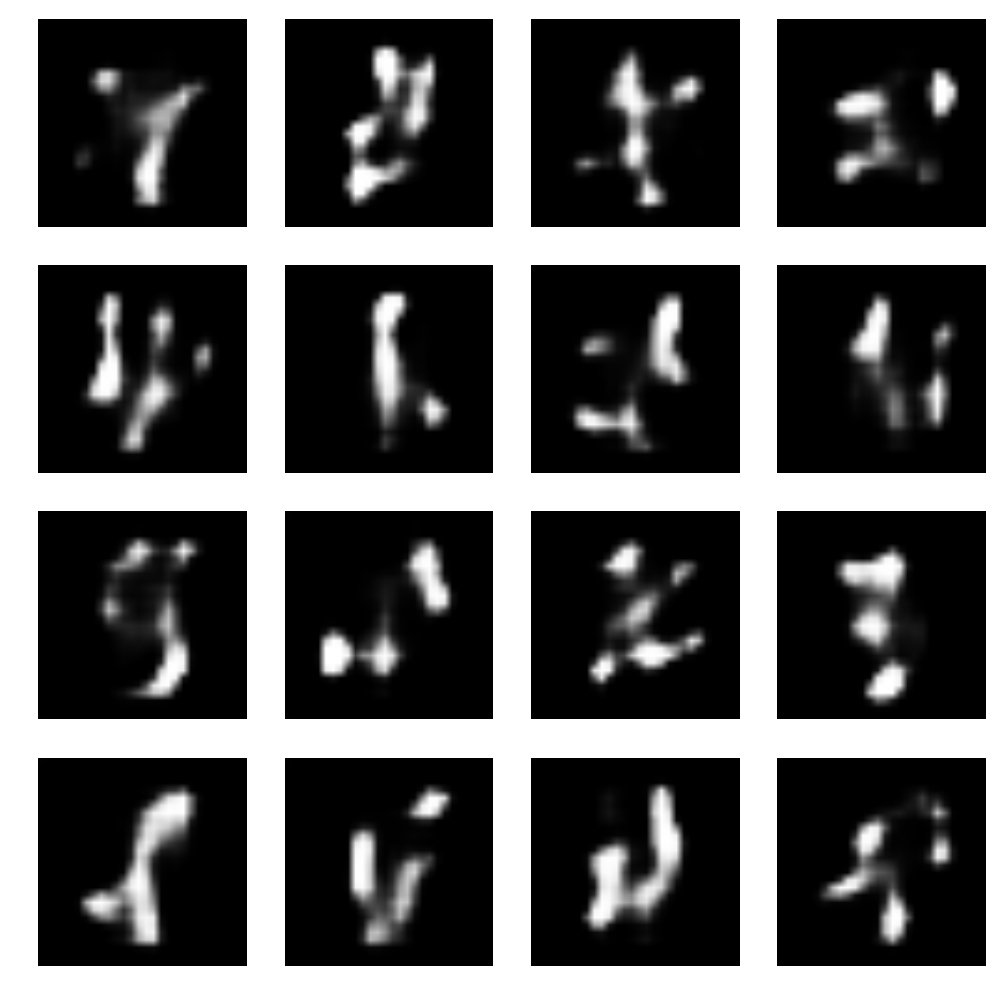
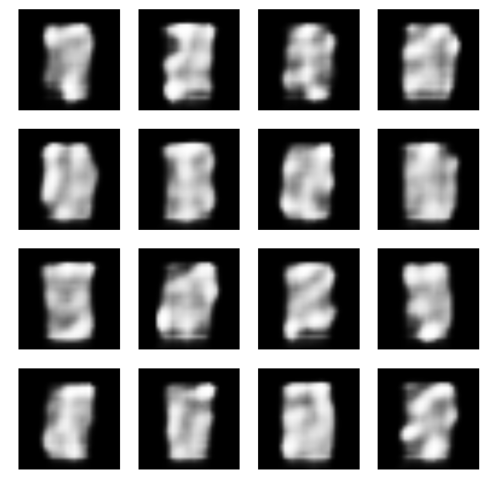

# MNIST Generative Adversarial Networks

This project is aimed at exploring Generative Adversial Networks for MNIST.
The main components are:

1. Discriminator: The discriminator job is to take a 28x28x1 image as input and give the probability that the image is a digit. 
2. Generator: The generator job is to generate a 28x28x1 image that resemeble MNIST image.
3. Adversarial: The adversarial network consists of the generator followed by the discriminator.

The following shows the discriminator architecture:

Input is: 28x28x1

| Layer (type)                                     | Size                     |
| ------------------------------------------------ |:------------------------:|
| 5x5 Convolution with stride of 2                 | Batchx14x14x64           |
| Leaky RELU with alpha of 0.2                     | SAME                     |
| Dropout with 0.4 probability                     | SAME                     |
| 5x5 Convolution with stride of 2                 | Batchx7x7x128            |
| Leaky RELU with alpha of 0.2                     | SAME                     |
| Dropout with 0.4 probability                     | SAME                     |
| 5x5 Convolution with stride of 2                 | Batchx4x4x256            |
| Leaky RELU with alpha of 0.2                     | SAME                     |
| Dropout with 0.4 probability                     | SAME                     |
| 5x5 Convolution with stride of 2                 | Batchx4x4x512            |
| Leaky RELU with alpha of 0.2                     | SAME                     |
| Dropout with 0.4 probability                     | SAME                     |
| Reshape to 8192                                  | Batchx8192               |
| Fully Connected Layer                            | Batchx1                  |
| Sigmoid activation                               | SAME                     |

Output is the probability that 28x28x1 is a digit and it is between 0.0 and 1.0
RMSprop with learning rate of 0.0002 and decay of 6e-8 is used here.
Loss used is binary_crossentropy

The following shows the generator architecture:

Input is: 100

| Layer (type)                                     | Size                            |
| ------------------------------------------------ |:-------------------------------:|
| Fully Connected Layer                            | Batchx12544 (7x7x(64+64+64+64)) |
| Batch Normalization                              | SAME                            |
| RELU                                             | SAME                            |
| Reshape                                          | 7x7x(64+64+64+64)               |
| Dropout with 0.4 probability                     | SAME                            |
| UpSampling2D                                     | 14x14x(64+64+64+64)             |
| Conv2DTranspose with 128 filters and SAME padding| 14x14x(64+64)                   |
| BatchNormalization                               | SAME                            |
| RELU activation                                  | SAME                            |
| UpSampling2D                                     | 28x28x(64+64)                   |
| Conv2DTranspose with 64 filters and SAME padding | 28x28x(64)                      |
| Batch Normalization                              | SAME                            |
| RELU activation                                  | SAME                            |
| Conv2D Tranpose with 32 filters and SAME padding | 28x28x32                        |
| Batch Normalization                              | SAME                            |
| RELU activation                                  | SAME                            |
| Conv2D Tranpose with 1 filter and SAME padding   | 28x28x1                         |
| Sigmoid activation                               | SAME                            |

Output is 28x28x1 which the generator will try to make to resemble a digit.

The adversial network consists of Generator followed by Discriminator.
RMSprop with learning rate of 0.0001 and decay of 3e-8 is used here.
Loss used is binary_crossentropy.

# Training

10000 training steps with batch size of 256 is used and a check point each 500 interval.
Each training step the following happens:

1. Random 256 images are selected from MNIST
2. A noise is generated from a uniform distribution between -1.0 and 1.0 with shape (batch_size, 100)
3. Fake images are generated from the generator given the noise
4. X is the result from 1 (real images) concatenated with result from 3 (fake images). Y is 1 for the real images and 0 for the fake images.
5. The discriminator is trained on that batch from step 4.
6. Noise is generated as random distribution from -1.0 to 1.0 as X, and 1 as Y and it is fed to the adverserial network.

If you look at the training batch, it tries to do two things:

1. Train Discriminator to distinguish between real images and fake images.
2. Train Adverserial that way the feedback from the discriminator will help the generator in order to tweak the images to look real.

# Progress

The following shows the progress of how the generator improves at 500 intervals:

500 Mark:

1000 Mark:

1500 Mark:

2000 Mark:

2500 Mark:

3000 Mark:

